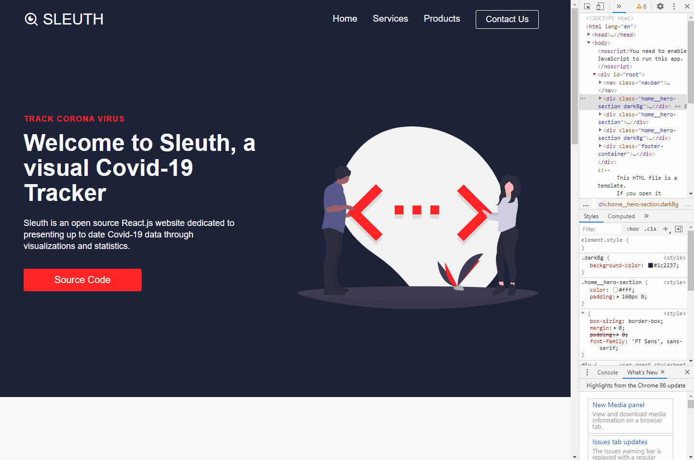
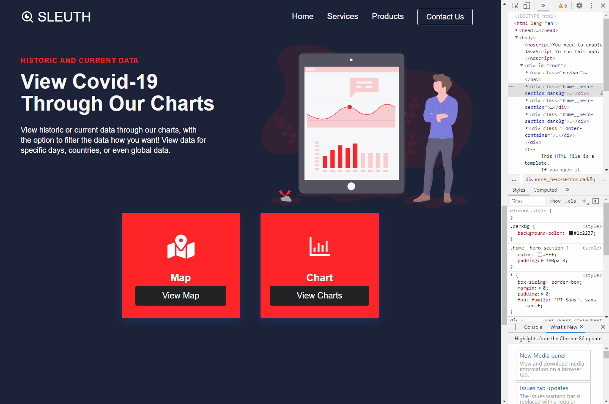

This project was bootstrapped with [Create React App](https://github.com/facebook/create-react-app).
## DEMO
### `MOBILE RESPONSIVE`

### `INTERACTIVE & ANIMATED GRAPHS`

## React.js Website

This is a website made in React.js with the purpose of tracking the corona virus through API calls and displaying information visually. Currently you can view the information through LineChart, BarChart, and PieChart. The goal is to have a corona virus map up and running along with the chart options.

## API BEING USED
https://covid19.mathdro.id/api

## Dependencies
    "@material-ui/core": "^4.11.0",
    "@testing-library/jest-dom": "^4.2.4",
    "@testing-library/react": "^9.5.0",
    "@testing-library/user-event": "^7.2.1",
    "axios": "^0.20.0",
    "chart.js": "^2.9.4",
    "classnames": "^2.2.6",
    "react": "^17.0.1",
    "react-chartjs-2": "^2.10.0",
    "react-countup": "^4.3.3",
    "react-dom": "^17.0.1",
    "react-icons": "^3.11.0",
    "react-router-dom": "^5.2.0",
    "react-scripts": "3.4.4"

